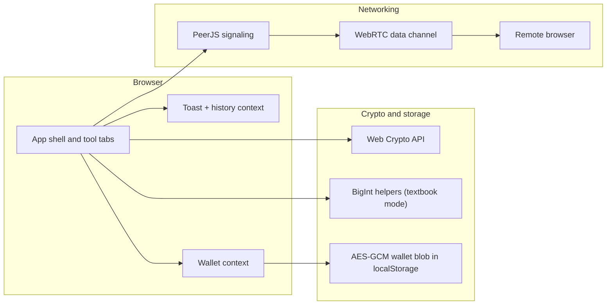
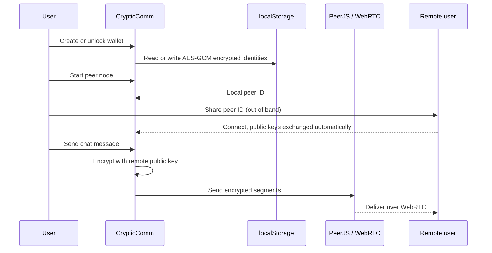

<div align="center">
  
  <h1>CrypticComm</h1>
  <p><strong>An RSA workspace that runs entirely in your browser.</strong></p>
  <p>Generate keys, encrypt and decrypt messages, sign and verify, store identities in an encrypted wallet, and chat with another browser over WebRTC. Built with Next.js, React, Tailwind CSS, the Web Crypto API, and PeerJS.</p>

  <p>
    
    
    
    
    
    <a href="https://crypticcomm.vercel.app"></a>
  </p>
</div>

> **Note:** CrypticComm started as university coursework. It uses standard browser cryptography and keeps keys local, but it has never been audited. Treat it as a teaching tool, not a secure messaging product.

## Where it started

CrypticComm is a much-expanded version of a SageMath program written for a group project in MA6011, Cryptographic Mathematics. The assignment paired up groups and had them run RSA by hand, in phases. Group A generated a key pair whose primes p and q were 300-digit numbers, spaced far enough apart that Fermat's factorization method would get nowhere, with seeded random generation so the lecturer could reproduce every value. Group B took about a thousand words of English literature, split them into ten segments, turned each segment into a large integer using a text encoding both groups had agreed on beforehand, and encrypted the lot with Group A's public key. Group A decrypted the segments and sent the recovered text back, and the whole thing was submitted as a single documented Sage script.

This app is that workflow rebuilt as an interactive tool. The agreed text-to-integer dictionary became `textToBigInt` and `bigIntToText`, the ten blocks became the segmentation engine, the raw m^e mod n arithmetic survives as textbook mode, and the email exchange between groups became the peer chat. Around that core it adds the things the assignment deliberately left out, which is where the real lessons start: proper padding (OAEP), signatures (RSA-PSS), key fingerprints, integrity checks, and an encrypted key wallet.

## Why it exists

Learning RSA usually means bouncing between a key generator here, a PEM converter there, and a signing demo somewhere else, losing the thread at each hop. CrypticComm puts the whole lifecycle in one place: create a key, encrypt with it, decrypt, sign, verify, then use the same key to chat with a second browser. Each step feeds the next, which makes the concepts much easier to hold onto.

## The tools

| Tab | What it does |
| --- | --- |
| Keys | Generates 1024/2048/4096-bit RSA pairs with JSON and PEM export, plus a key fingerprint |
| Encrypt | Encrypts text with a public key (OAEP or raw textbook RSA), with a live byte and segment estimate |
| Decrypt | Rebuilds plaintext, shows per-segment results, and checks the payload's embedded SHA-256 |
| Sign | Creates RSA-PSS (SHA-256) signatures as hex |
| Verify | Checks a signature against a message and public key |
| Peer chat | Connects two browsers through PeerJS; messages are RSA-encrypted, and each bubble can show its ciphertext |
| History | Session-only log of what you did, gone on refresh |
| Wallet | Header modal that stores identities encrypted in localStorage, with import for exported keys |

The tools feed each other. An encrypted payload has an "Open in Decrypt" button, a fresh signature has "Check in Verify", and the chat session keeps running while you work in other tabs, with an unread counter on the tab.

Textbook RSA is included on purpose. Seeing that the same plaintext always encrypts to the same ciphertext, then switching to OAEP and watching that stop, teaches more about padding than any paragraph could.

## How it fits together



There is no custom backend. The only server involved is the public PeerJS signaling server, which helps two browsers find each other; the chat messages themselves travel peer to peer, encrypted with the recipient's public key before they leave the sender.

## Security model

- Key pairs are generated in the browser with the Web Crypto API and never uploaded.
- OAEP encryption, RSA-PSS signing, and verification all run locally.
- The wallet encrypts identities with AES-GCM before writing to localStorage. The key is derived from your master password with PBKDF2-SHA256 at 600,000 iterations, in line with current OWASP guidance. Each payload records its own KDF parameters, so the work factor can be raised later without stranding old wallets; wallets created before this scheme are re-encrypted at the current strength the next time they are unlocked. Forget the password and the data is gone; there is no recovery path.
- Imported keys are validated before they enter the wallet, including a check that p times q actually equals the modulus.
- Every key gets a short SHA-256 fingerprint. Peer chat shows yours and your peer's side by side; reading them to each other over a call is the standard defence against a swapped key at the signaling server.
- Encrypted payloads carry the SHA-256 of the original message, and Decrypt compares it against what it recovered.
- History lives in React state only and resets with the page.
- Peer discovery goes through PeerJS signaling, so using the chat is not the same as being fully offline.
- Locking the wallet ends any live chat session, since the identity it was using leaves memory.



## Design

The interface is a single dark theme built around one accent color taken from the logo. Type is set in Geist and Geist Mono (key material, hashes, and stats are always mono). Navigation is a tab bar with full keyboard support: arrow keys move between tools, and the bar scrolls horizontally on phones. Inputs stay at 16px on small screens so iOS doesn't zoom on focus, and every tool stacks into a single column on mobile.

## Getting started

The hosted copy at [crypticcomm.vercel.app](https://crypticcomm.vercel.app) is the quickest way in. To run it locally you'll need Node.js 20 or newer.

```bash
npm install
npm run dev
```

Then open [http://localhost:3000](http://localhost:3000).

A good first run:

1. Generate a 2048-bit key in the Keys tab and save it to the wallet.
2. Encrypt a message with it, then follow the payload into Decrypt with one click.
3. Sign a message, check it in Verify, then change one character and check again.
4. Open Peer chat in two browser windows, swap peer IDs, and compare the key fingerprints before you trust the channel.

No environment variables are needed.

## Scripts

| Script | What it does |
| --- | --- |
| `npm run dev` | Starts the development server |
| `npm run build` | Creates a production build |
| `npm run start` | Serves the production build |
| `npm run lint` | Runs ESLint |
| `npm test` | Runs the unit tests (Vitest) |

`npm run lint`, `npm run build`, and `npm test` all pass on the current code. The tests
cover the crypto helpers end to end: OAEP and textbook round trips, tamper cases,
RSA-PSS sign and verify, key parsing, segmentation, wallet encryption, and
fingerprints, running against Node's built-in WebCrypto.

## Deployment

The app deploys to Vercel without configuration: push the repository, import it, deploy. That is exactly how [crypticcomm.vercel.app](https://crypticcomm.vercel.app) is hosted. It builds to static client pages, so there is no database or API to set up. Next.js will suggest installing `sharp` for image optimization in production; the build works without it.

## Project structure

```text
crypticcomm/
├── app/
│   ├── layout.tsx        Fonts, metadata, document shell
│   └── page.tsx          App shell: header, tab bar, panels, footer
├── components/
│   ├── HomeTab.tsx       Landing view and tool directory
│   ├── KeyGen.tsx        Key generation
│   ├── Encrypt.tsx       Encryption
│   ├── Decrypt.tsx       Decryption
│   ├── Sign.tsx          RSA-PSS signing
│   ├── Verify.tsx        Signature verification
│   ├── Network.tsx       Peer chat view (fingerprints, ciphertext inspection)
│   ├── NetworkContext.tsx App-wide PeerJS session, so chat survives tab switches
│   ├── WorkbenchContext.tsx Tab state and cross-tool handoffs
│   ├── HistoryTab.tsx    Session history list
│   ├── WalletModal.tsx   Create, unlock, import, and manage the wallet
│   ├── WalletContext.tsx Encrypted wallet state
│   ├── HistoryContext.tsx / ToastContext.tsx
│   └── ui/               Shared primitives (buttons, cards, key pickers, motion)
├── lib/
│   ├── rsa.ts            Crypto helpers: keygen, OAEP, PSS, PEM, wallet encryption
│   ├── rsa.test.ts       Unit tests for everything above
│   └── download.ts       File download helpers
└── styles/globals.css    Design tokens and component classes
```

## Known limitations

- No accounts, no server-side storage, and no message history across sessions. This is deliberate.
- The wallet is only as strong as its master password, and localStorage is not hardware-backed storage.
- Textbook mode is insecure by design; it exists to be broken in demonstrations.
- Peer chat needs both browsers online at the same time and can be blocked by strict NATs or firewalls.
- The chat supports one conversation at a time; extra incoming connections are refused while a session is active.
- Unit tests cover the crypto library; the UI itself is still verified manually.

## License

MIT. See [LICENSE](./LICENSE).
