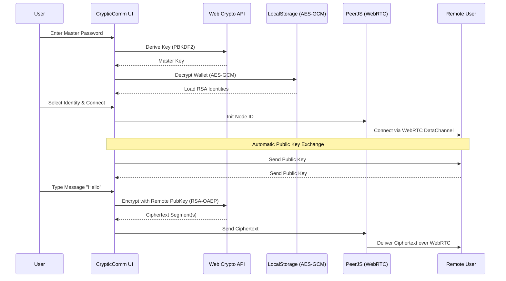

<div align="center">
  <div style="display: flex; justify-content: center; align-items: center; width: 80px; height: 80px; background: linear-gradient(135deg, #4f46e5, #7c3aed); border-radius: 20px; margin: 0 auto 20px auto; box-shadow: 0 10px 25px -5px rgba(99, 102, 241, 0.4);">
      <svg xmlns="http://www.w3.org/2000/svg" width="40" height="40" viewBox="0 0 24 24" fill="none" stroke="white" stroke-width="2" stroke-linecap="round" stroke-linejoin="round"><path d="M12 22s8-4 8-10V5l-8-3-8 3v7c0 6 8 10 8 10z"/><path d="m9 12 2 2 4-4"/></svg>
  </div>
  
  <h1>CrypticComm <span style="color: #818cf8;">(Re-Engineered Edition)</span></h1>
  <p><strong>A Modern, Zero-Server-State RSA Cryptography & Peer-to-Peer Learning Suite</strong></p>
  <p><em>Built with Next.js, TypeScript, Tailwind CSS, and Web Crypto API</em></p>
  <br/>
</div>

> **⚠️ Educational Disclaimer**
> 
> CrypticComm is an **educational tool and proof-of-concept**. While it utilizes standard Web Crypto implementations for algorithms like RSA-OAEP, AES-GCM, and PBKDF2, it has **not** undergone formal security code review or penetration testing. It is designed to teach cryptographic concepts visually. **Do not use for highly sensitive, real-world data.**

---

**CrypticComm** is an interactive, privacy-first web application designed to democratize the understanding of public-key cryptography. Originally built as a server-side Python/Streamlit app for a Cybersecurity Course Module, this **Next.js Edition** brings the entire cryptographic lifecycle and real-time peer-to-peer communication directly into your browser.

Your keys never leave your device. There are no servers processing your math, no databases storing your history, and no hidden tracking. Everything is handled locally via the native browser Web Crypto API.

---

## 🚀 Live Demo

Try CrypticComm instantly, with **no install needed**:

[](https://crypticcomm.vercel.app/)

---

## 📑 Table of Contents

- [Core Philosophy](#-core-philosophy)
- [Feature Breakdown](#%EF%B8%8F-feature-breakdown)
  - [1. Key Generation & Identities](#1-key-generation--identities)
  - [2. Encryption & Decryption](#2-encryption--decryption)
  - [3. Digital Signatures](#3-digital-signatures)
  - [4. Encrypted Browser Wallet](#4-encrypted-browser-wallet)
  - [5. P2P WebRTC Network](#5-p2p-webrtc-network)
- [Workflow Diagram](#-workflow-diagram)
- [Architecture & Tech Stack](#-architecture--tech-stack)
- [Getting Started](#-getting-started)
- [Project Structure](#%EF%B8%8F-project-structure)
- [Security Model](#-security-model)
- [License](#-license)

---

## ✨ Core Philosophy

*   **Zero Server State:** Absolute privacy. Because the app is 100% client-side, the server never sees your private keys, your messages, or your passwords.
*   **Educational Focus:** "Show the Math" transparency. CrypticComm allows users to toggle between secure modern padding (OAEP) and raw mathematical "Textbook RSA" to see exactly how algorithms operate.
*   **Interoperability:** Seamlessly import and export standard PKCS#8 / SPKI `.pem` files, making it compatible with real-world CLI tools (like OpenSSL).

---

## 🛠️ Feature Breakdown

### 1. Key Generation & Identities
Generate RSA key pairs directly in your browser without any server latency.
*   **Strengths:** Choose between **1024-bit** (fast/demo), **2048-bit** (standard security), or **4096-bit** (military grade).
*   **Identities:** Every key generated automatically gets a unique, deterministic "Identity Name" (e.g., *Cosmic Shield [A1B2]*) generated from the SHA-256 hash of its public modulus.
*   **Export:** Download keys instantly as Custom JSON or Standard `.pem` files, or copy them to your clipboard.

### 2. Encryption & Decryption
Securely encode and decode messages of any length.
*   **Automatic Chunking:** CrypticComm automatically segments large messages that exceed the maximum byte limit of the chosen RSA modulus, encrypting them in sequence.
*   **Modes:**
    *   **OAEP Padding (Default):** Utilizes highly secure Optimal Asymmetric Encryption Padding.
    *   **Textbook RSA:** Raw modular exponentiation ($c = m^e \pmod n$). Highly insecure, but perfect for educational demonstration.
*   **Smart Parsing:** Paste JSON payloads or raw `.pem` keys into the input areas; the app automatically detects and formats them correctly.

### 3. Digital Signatures
Prove you authored a message without encrypting the message itself.
*   **Sign:** Uses your Private Key and standard RSA-PSS (with SHA-256 hashing) to generate a unique hexadecimal signature for any plain text.
*   **Verify:** Anyone with your Public Key, the Original Message, and the Signature can cryptographically verify it hasn't been tampered with.

### 4. Encrypted Browser Wallet
Say goodbye to managing text files manually during a learning session.
*   **Vault Creation:** Click the **Wallet** icon in the header to create a secure vault.
*   **Cryptography:** Uses **PBKDF2** (100,000 iterations) to derive a strong key from your chosen Master Password. It then encrypts your saved identities using **AES-GCM** before pushing them to `localStorage`.
*   **Integration:** Unlock your wallet to instantly populate secure dropdown menus across all tools (Encrypt, Decrypt, Sign, Verify, Network) without exposing raw keys to the UI.

### 5. P2P WebRTC Network
Stop copy-pasting JSON blocks back and forth on external chat apps!
*   **Serverless Chat:** Navigate to the **Network** tab, select your Identity, and generate a Node ID.
*   **Direct Connection:** Share the Node ID with a partner to establish a direct WebRTC connection via PeerJS.
*   **Auto-Exchange:** Public keys are exchanged automatically under the hood. All messages typed in the chat are strictly end-to-end encrypted using RSA-OAEP before ever hitting the network layer.

### 6. Session History
Maintain an ephemeral audit trail of your cryptographic operations.
*   The **History** tab maintains a running log of your inputs, outputs, and success/failure states.
*   Data is strictly session-only and disappears the moment you refresh or close the tab, ensuring no sensitive plaintext lingers.

---

## 🔄 Workflow Diagram

Here is a high-level overview of how the Encrypted Wallet and P2P Network interact within the browser.



---

## 🏗 Architecture & Tech Stack

CrypticComm (Next.js Edition) ditches the original heavy Python backend for a sleek, edge-ready frontend architecture.

| Category | Technology | Purpose |
| :--- | :--- | :--- |
| **Framework** | Next.js 14 (App Router) | React framework for structure, routing, and optimization |
| **Language** | TypeScript | Strict typing for cryptographic parameters and states |
| **Styling** | Tailwind CSS v3.4 | Utility-first, responsive, neon dark-mode design |
| **Animations** | Framer Motion | Fluid mount/unmount and layout transitions |
| **Cryptography** | Web Crypto API | Native, un-polyfilled, high-speed browser cryptography |
| **Big Math** | JS `BigInt` | Custom modular exponentiation for Textbook RSA demos |
| **Networking** | PeerJS | WebRTC abstraction for the P2P Network tab |
| **Icons** | Lucide React | Beautiful, scalable SVG iconography |

---

## ⚡ Getting Started

You can run this project locally with just Node.js installed.

### 1. Install Dependencies
Clone the repository and install the required NPM packages.
```bash
cd cryptic-next
npm install
```

### 2. Start the Development Server
```bash
npm run dev
```

### 3. Open the App
Navigate to [http://localhost:3000](http://localhost:3000) in your web browser.

---

## 🗂️ Project Structure

```text
cryptic-next/
├── app/
│   ├── layout.tsx         # Global HTML layout and metadata
│   └── page.tsx           # Main application view and Tab navigation
├── components/
│   ├── KeyGen.tsx         # RSA Key Generation interface
│   ├── Encrypt.tsx        # Public key encryption logic
│   ├── Decrypt.tsx        # Private key decryption logic
│   ├── Sign.tsx           # RSA-PSS signature generation
│   ├── Verify.tsx         # Signature verification logic
│   ├── Network.tsx        # WebRTC P2P chat interface
│   ├── HistoryTab.tsx     # Session activity log
│   ├── WalletModal.tsx    # Password prompt & vault UI
│   ├── WalletContext.tsx  # AES-GCM state management
│   ├── HistoryContext.tsx # Ephemeral logging state
│   └── ui/
│       └── Motion.tsx     # Reusable Framer Motion wrappers (Cards, Buttons)
├── lib/
│   └── rsa.ts             # Core cryptographic engine (Web Crypto wrappers)
├── styles/
│   └── globals.css        # Tailwind directives and custom scrollbars
├── next.config.mjs        # Next.js configuration
├── tailwind.config.ts     # Design tokens and theme settings
└── package.json           # Scripts and dependencies
```

---

## 🛡️ Security Model

1. **Local Execution:** No data is sent to a backend API for processing. The `crypto.subtle` API executes natively within the V8 engine of your browser.
2. **Ephemeral Memory:** Unless explicitly saved to the Encrypted Wallet, generated keys are stored only in React state and are cleared upon page refresh.
3. **Wallet Encryption:** The wallet does not store plain text private keys. It relies on user-provided entropy (Master Password), hashed via PBKDF2 with 100k iterations, to serve as the key for AES-GCM encryption of the local storage payload.
4. **Peer Connection:** The PeerJS connection uses WebRTC data channels, which are inherently encrypted via DTLS, but CrypticComm adds a secondary layer of RSA-OAEP end-to-end encryption on the payload itself for demonstration purposes.

---

## 📄 License

**[MIT License](LICENSE)**

You are free to use, modify, and distribute this software for educational and personal projects. Please retain attribution to the original author. 

*Re-engineered with ❤️ for the Modern Web.*
