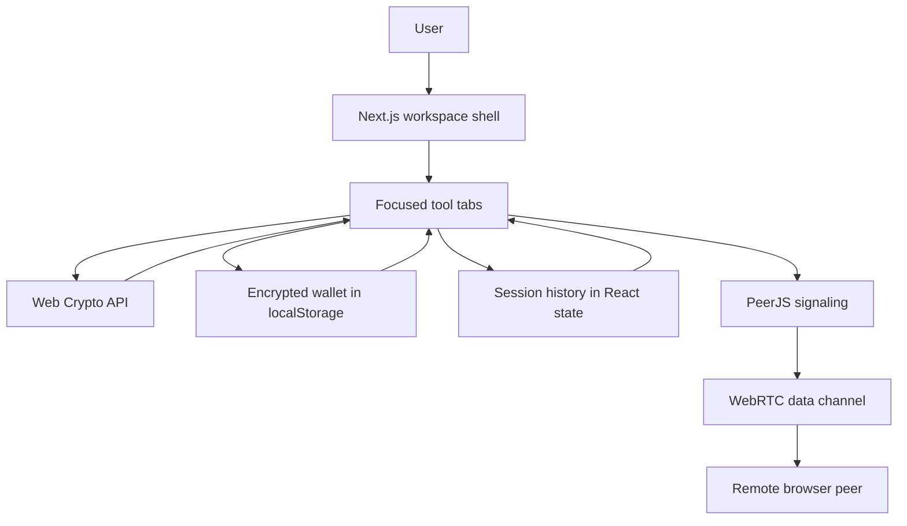
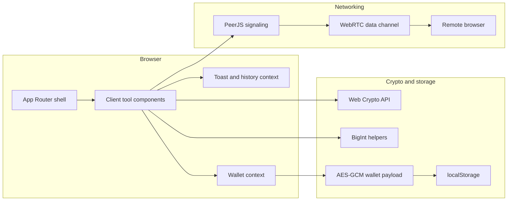
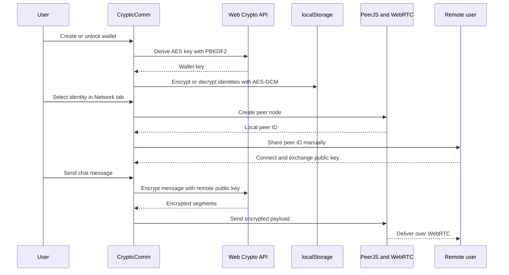

<div align="center">
  
  <h1>CrypticComm</h1>
  <p><strong>A browser-first RSA cryptography workspace for learning, experimenting, and testing secure messaging flows without a custom backend.</strong></p>
  <p><em>Built with Next.js, React, Tailwind CSS, Framer Motion, the Web Crypto API, and PeerJS.</em></p>

  <p>
    
    
    
    
    
  </p>
</div>

> **Project note**
>
> CrypticComm is an educational cryptography application, not a formally audited security product. It uses standard browser cryptography primitives and keeps sensitive work local where possible, but it should still be treated as a teaching and experimentation tool rather than a production secure messaging platform.

---

CrypticComm brings the main RSA learning workflows into one focused workspace.

Instead of bouncing between a key generator, a PEM converter, a signing demo, a decryption scratchpad, and a separate chat experiment, the app keeps the full lifecycle in one tabbed interface. The goal is to make public-key cryptography easier to understand, easier to demonstrate, and easier to test in practice.

## Table of Contents

- [At a Glance](#at-a-glance)
- [What the App Covers](#what-the-app-covers)
- [Feature Map](#feature-map)
- [How the App Fits Together](#how-the-app-fits-together)
- [Architecture](#architecture)
- [Security and Trust Model](#security-and-trust-model)
- [Tech Stack](#tech-stack)
- [Workspace Tabs and User Flows](#workspace-tabs-and-user-flows)
- [Getting Started](#getting-started)
- [Environment Variables](#environment-variables)
- [Available Scripts](#available-scripts)
- [Deployment on Vercel](#deployment-on-vercel)
- [Project Structure](#project-structure)
- [Implementation Notes](#implementation-notes)
- [Verification](#verification)
- [Current Limitations](#current-limitations)

---

## At a Glance

| Area | Summary |
| --- | --- |
| Purpose | A browser-native RSA learning and experimentation workspace |
| App shape | Single-page tabbed interface with focused tool views |
| Frontend | Next.js App Router with React 18 |
| Crypto engine | Web Crypto API plus `BigInt` helpers for textbook RSA demos |
| Local persistence | AES-GCM encrypted wallet stored in `localStorage` |
| Session persistence | Ephemeral in-memory history for the current browser session |
| Networking | PeerJS for signaling and WebRTC data channels for direct peer chat |
| Backend | No custom API or database in the current build |
| Deployment target | Vercel |

## What the App Covers

CrypticComm includes:

- RSA key generation in the browser
- JSON and PEM-based key import and export
- OAEP encryption and decryption
- textbook RSA for demonstration purposes
- RSA-PSS signing and verification
- a local encrypted wallet for saved identities
- session-only history tracking
- encrypted peer-to-peer chat over WebRTC

That mix is intentional. The app is designed to help someone move from key creation to encryption to verification to peer messaging without losing context halfway through.

## Feature Map

| Area | Workspace tab | What it does | Why it matters |
| --- | --- | --- | --- |
| Home | `Home` | Introduces the platform and links users into the main workflows | Gives the app a clear front door |
| Identity generation | `KeyGen` | Creates RSA key pairs locally and supports JSON or PEM export plus wallet save | Starts most workflows cleanly |
| Encryption | `Encrypt` | Encrypts plaintext with OAEP or textbook RSA and emits segmented JSON payloads | Makes RSA message flow tangible |
| Decryption | `Decrypt` | Reassembles and decrypts payload segments using the matching private key | Lets users inspect recovery and failure cases |
| Signatures | `Sign` | Produces RSA-PSS signatures from a private key | Demonstrates authenticity without encryption |
| Verification | `Verify` | Checks whether a signature matches a given message and public key | Reinforces integrity and authorship concepts |
| Wallet | Header modal | Stores identities locally in an encrypted browser vault | Avoids constant copy-paste between tools |
| Network | `Network` | Exchanges peer IDs and public keys, then sends encrypted chat messages | Extends the learning flow into direct messaging |
| Session review | `History` | Shows recent encrypt, decrypt, sign, and verify events for the current session | Helps users review what they just did |

## How the App Fits Together



The key design decision is that CrypticComm does not behave like a generic crypto playground page with everything stacked vertically. Each task lives in its own view, but the app still shares one persistent workspace shell, one wallet, and one session context.

## Architecture

### High-level view



### Design choices

| Choice | Why it matters |
| --- | --- |
| Single-page tabbed workspace | Keeps the app easy to navigate while still separating each cryptographic task |
| Browser-only cryptography | Private keys and plaintext do not need a custom server round trip |
| Wallet encryption with PBKDF2 + AES-GCM | Saved identities are protected at rest in local browser storage |
| Session-only history | Recent actions are reviewable without creating long-term sensitive logs |
| PeerJS plus WebRTC | The network tab can demonstrate real peer messaging without building a custom signaling backend |
| Shared UI primitives | Cards, buttons, empty states, and tool layouts stay visually consistent |

## Security and Trust Model

| Area | Current behaviour |
| --- | --- |
| Key generation | RSA key pairs are generated in the browser with the Web Crypto API |
| Encryption and signatures | OAEP and RSA-PSS operations execute locally in browser memory |
| Wallet storage | Saved identities are encrypted with AES-GCM using a PBKDF2-derived key |
| Session history | History is stored only in React state and disappears on refresh or close |
| Peer chat messages | Outgoing messages are RSA-encrypted before being sent over WebRTC |
| Peer signaling | PeerJS still uses a signaling layer to help browsers find each other |
| Production readiness | The app is educational and proof-of-concept oriented, not formally audited |

### Wallet and peer flow



## Tech Stack

| Category | Technology | Purpose |
| --- | --- | --- |
| Framework | Next.js 14.2.35 | App shell, routing, build pipeline, deployment readiness |
| UI | React 18 | Component model and client-side interactivity |
| Styling | Tailwind CSS 3.4 | Layout, tokens, spacing, and responsive styling |
| Motion | Framer Motion | Enter transitions, tab changes, and UI polish |
| Cryptography | Web Crypto API | RSA-OAEP, RSA-PSS, PBKDF2, AES-GCM |
| Math helpers | Native `BigInt` | Textbook RSA demonstration mode |
| Networking | PeerJS | WebRTC signaling and peer connection abstraction |
| Icons | Lucide React | Consistent SVG iconography |
| Utility libraries | `clsx`, `tailwind-merge` | Class composition and UI utility cleanup |

## Workspace Tabs and User Flows

### 1. Home

The Home tab acts as the landing view for the current shell. It gives users:

- a quick explanation of what the app is for
- a cleaner first impression than dropping directly into a crypto form
- direct jump points into key generation and peer networking

### 2. KeyGen

The KeyGen flow supports:

- 1024-bit keys for fast demos
- 2048-bit keys for standard use
- 4096-bit keys for heavier experiments
- JSON and PEM export
- wallet save for later reuse

The generated identity name is deterministic, which makes repeated demos easier to follow.

### 3. Encrypt

The Encrypt tab is designed around a simple sequence:

1. load a public key
2. enter plaintext
3. choose OAEP or textbook RSA
4. export the resulting segmented payload

This makes the difference between secure padding and raw RSA much easier to see.

### 4. Decrypt

The Decrypt tab reverses that flow and reports:

- recovered plaintext
- per-run status
- segment failure count
- output hash

It also supports plaintext export so the end of the workflow feels complete.

### 5. Sign

The signing workflow is intentionally focused:

- load a private key
- enter the exact message
- generate an RSA-PSS signature
- copy or download the resulting hex output

### 6. Verify

The verification workflow checks three things together:

- the signer public key
- the original message
- the signature

The result panel is intentionally simple and decisive so it is easy to demo in a classroom or report context.

### 7. Network

The network tab demonstrates a real peer messaging flow:

- choose an identity from the wallet
- initialize a local node
- share your peer ID manually
- connect to another browser
- exchange public keys automatically
- send encrypted chat messages

This part of the app is especially useful for showing how key exchange and encrypted transport relate to each other.

### 8. History

History is session-only by design. It helps users review recent actions without creating a persistent log of sensitive material.

## Getting Started

### Prerequisites

- Node.js 20 or newer is recommended
- npm

### 1. Install dependencies

```bash
npm install
```

### 2. Start the development server

```bash
npm run dev
```

Then open [http://localhost:3000](http://localhost:3000).

### 3. Suggested first run

1. Open `KeyGen` and generate a 2048-bit identity.
2. Save it to the browser wallet.
3. Use `Encrypt` and `Decrypt` to test the roundtrip.
4. Use `Sign` and `Verify` to test the signature flow.
5. Open `Network` in two browser windows if you want to try the peer chat workflow.

## Environment Variables

This project currently requires no environment variables for normal local development.

| Variable | Required | Purpose |
| --- | --- | --- |
| None | No | The current build is fully client-driven |

### Important note about networking

The `Network` tab relies on PeerJS signaling to establish WebRTC connections between browsers. Cryptographic work still happens locally, but peer discovery is not the same thing as operating fully offline.

## Available Scripts

| Script | What it does |
| --- | --- |
| `npm run dev` | Starts the local development server |
| `npm run build` | Creates a production build |
| `npm run start` | Runs the production server |
| `npm run lint` | Runs ESLint across the project |

## Deployment on Vercel

CrypticComm is structured to deploy cleanly on Vercel.

### Basic deployment steps

1. Push the repository to a Git provider.
2. Import the project into Vercel.
3. Deploy.

### Deployment notes

- No database or external API configuration is required for the current version.
- The app is mostly static client UI with browser-side logic.
- The optional network workflow still depends on live browser-to-browser connectivity.
- Next.js may recommend installing `sharp` for production image optimization, but the app can build without it.

## Project Structure

```text
crypticcomm-main/
+-- app/
|   +-- layout.tsx
|   \-- page.tsx
+-- assets/
|   +-- favicon.png
|   \-- logo.png
+-- components/
|   +-- Decrypt.tsx
|   +-- Encrypt.tsx
|   +-- HistoryContext.tsx
|   +-- HistoryTab.tsx
|   +-- HomeTab.tsx
|   +-- KeyGen.tsx
|   +-- Network.tsx
|   +-- Sign.tsx
|   +-- ToastContext.tsx
|   +-- Verify.tsx
|   +-- WalletContext.tsx
|   +-- WalletModal.tsx
|   \-- ui/
|       \-- Motion.tsx
+-- lib/
|   \-- rsa.ts
+-- styles/
|   \-- globals.css
+-- next.config.mjs
+-- package.json
\-- README.md
```

### Quick file guide

| File | Role |
| --- | --- |
| `app/page.tsx` | Main workspace shell, tab navigation, and top-level providers |
| `app/layout.tsx` | Global metadata, font setup, favicon wiring, and document shell |
| `lib/rsa.ts` | Core RSA helpers, PEM conversion, signature logic, and wallet encryption |
| `components/WalletContext.tsx` | Encrypted wallet state and persistence layer |
| `components/Network.tsx` | Peer setup and encrypted chat workflow |
| `components/HistoryContext.tsx` | Session-only action history |
| `components/ui/Motion.tsx` | Shared UI primitives such as cards, buttons, and file upload controls |

## Implementation Notes

### Encryption modes

CrypticComm intentionally supports two modes:

- OAEP, which is the secure default
- textbook RSA, which is unsafe but useful for demonstration

That second mode is there to teach, not to recommend.

### Wallet handling

The wallet:

- stores identities only after explicit save
- encrypts them before writing to `localStorage`
- keeps decrypted identities in memory only while the wallet is unlocked

### Session history

History is intentionally lightweight:

- it records recent action summaries
- it truncates oversized message and output fields
- it resets with the session

### UI design direction

The current build uses:

- a dedicated Home tab for orientation
- persistent tool navigation
- more consistent button sizing
- cleaner composer and output panels
- shared empty states and action cards across the toolset

## Verification

The current codebase has been checked with:

```bash
npm run lint
npm run build
```

Both commands pass on the current project.

The app was also checked locally with:

- successful `next dev` startup
- HTTP `200` response from the root route
- expected workspace markers present in the served HTML
- RSA roundtrip verification for key generation, OAEP encrypt/decrypt, RSA-PSS sign/verify, and wallet encrypt/decrypt

### Manual smoke test

If you want to validate the app yourself in a few minutes:

1. Generate a key in `KeyGen`.
2. Save it to the wallet.
3. Encrypt a message with the public key.
4. Decrypt it with the private key.
5. Sign a message.
6. Verify the signature with the public key.
7. Open `Network` in two browser windows and exchange peer IDs.

## Current Limitations

The current build does not include:

- user accounts
- shared multi-user history
- server-side storage
- formal cryptographic auditing
- automated two-peer browser testing in the repository itself

That is intentional for this version. The app is designed to stay simple, local-first, and easy to understand.

## Closing Note

CrypticComm is meant to make public-key cryptography feel less abstract.

It should help someone generate a key, inspect a payload, understand why signatures matter, and test a browser-to-browser encrypted message flow without needing a heavyweight backend or a pile of disconnected tools.

That is the standard this version was built around.
